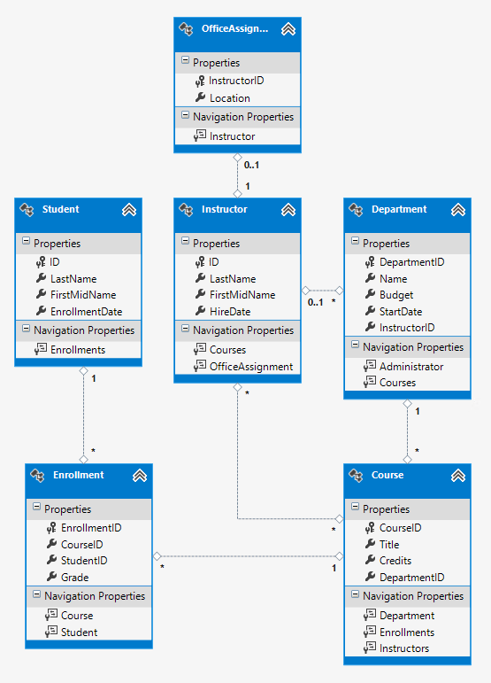
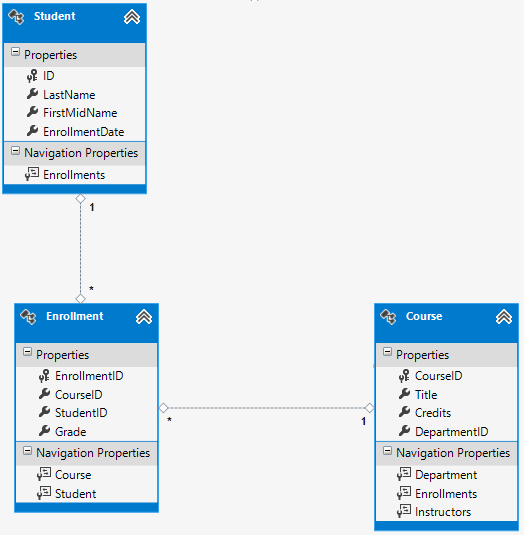
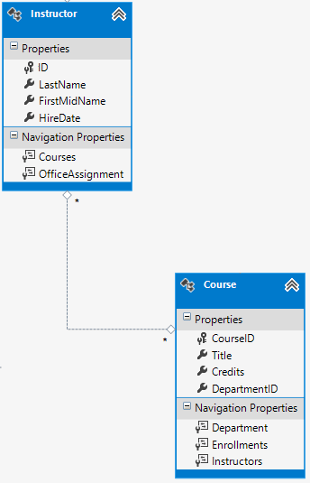
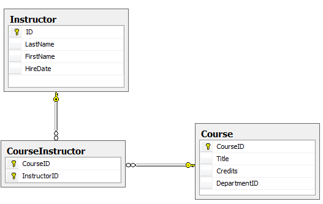

# Getting Started with Entity Framework 6 using MVC 5

#### Source
[Entity Framework 6]
(http://www.asp.net/mvc/tutorials/getting-started-with-ef-using-mvc/creating-an-entity-framework-data-model-for-an-asp-net-mvc-application "Microsoft ASP.NET")

## 1. Creating and Entity Framework Data Model


This section explains how the new project is set up.

#### 1.1 Initial Setup

Unlike the *MvcMovie* project, where the ability for users to log in was assumed
(but not implemented), this project explicitly removes the rewquirement that users
should log in. Thus, while creating the project, when a template is being chosen
in the New Project wizard, the authentication is removed by clicking the 
*Change Authentication* button and selecting the *No Authentication* option in the
next window.

#### 1.2. Install Entity Framework

If EF is missing, install it as follows:

1. Open Tools > Library/NuGet Package Manager > Package Manager Console
2. In the Package Manager Console, run the following command:

```
Install-Package EntityFramework
```

#### 1.3. Creating the Models

Models in an MVC application represent the data that will be used and persisted
to the database. The models have two kinds of properties:

* Those that are unique to the model. These represent the attributes of the model
itself. By default, any named *ID* or *classNameID* is used as the primary key
in the database. Using *ID* makes it easier to implement inheritance. Either way,
whichever mode is picked should be the one consistently used throughout.

* Those used to show an association/ a relationship between two models/entities.
Such properties are known as **_Navigation Properties_**. A navigation property
holds other entities that are related to this entity. Each relationship 
between models is defined by two ends, describing the entity type and the 
multiplicity of the type (one, zero-or-one, or many). Common relationships include
*one-to-many*, *one-to-one* and *many-to-many*.

The models used are as follows:

**(a). The Student Entity**

Each `Student` has a unique identifier, as well as properties to hold the name 
and enrollment date. A `Student` can have several `Enrollments`, which is, here,
a way to define the relationship between a `Student` and a `Course`. Having
multiple `Enrollment` objects shows that a single student can enroll in multiple
courses.

```c#
public class Student
{
    public int ID {  get; set; }    // primary key
    public string LastName { get; set; }
    public string FirstMidName { get; set; }
    public DateTime EnrollmentDate { get; set; }

    // navigation property
    public virtual ICollection<Enrollment> Enrollments { get; set; }
}
```

Navigation properties are typically declared as `virtual`, to take advantage of
Entity Framework functionality such as *lazy loading*. If a navigation property
can hold multiple entities (such as a many-to-many or one-to-many relationships),
then its type must be a list allowing CRUD operations.

**(b). The Enrollment Entity**

As noted earlier, `Enrollment` defines the relationship between a `Student` and
a `Course`. Each `Enrollment` object has a unique identifier and a `Grade`. It 
also holds references to the `Student` and `Course` objects that together create
this `Enrollment`; the `ID` fields of each are the foreign keys for each 
`Enrollment` item into its respective `Student` and `Course` rows. 

```c#
public enum Grade
{
    A, B, C, D, F
}
public class Enrollment
{
    // primary key
        public int ID { get; set; }
 
        // nullable; null grade != zero grade
        public Grade? Grade { get; set; }

        // foreign keys
        public int CourseID { get; set; }   
        public int StudentID { get; set; } 

        // navigation properties
        // one-to-one relationship with both
        public virtual Course Course { get; set; } 
        public virtual Student Student { get; set; }
}
```

Entity Framework interprets a property as a foreign key if its name follows the
syntax *< navigation property name > < primary key property name >*, e.g. `StudentID`
for the `Student` navigation property, since `Student` is the navigation property
name, and `ID` is the primary key of `Student`. An alternative syntax used for
classes that use *classNameID* as the primary key is *< primary key property name >*,
(since the first format would result in, for instance, `StudentStudentID` if the
primary key of the `Student` model was `StudentID`).

**(c). The Course Entity**

The `Course` entity contains a unique identifier, a title and credits. It has a
reference to the collection of `Enrollment` objects that would include it, since
multiple students are allowed to enrol in any one course.

```c#
public class Course
{
    // primary key; have it not automatically generated by database.
    [DatabaseGenerated(DatabaseGeneratedOption.None)]
    public int ID { get; set; }

    public string Title { get; set; }
    public int Credits { get; set; }

    // navigation property
    public virtual ICollection<Enrollment> Enrollments { get; set; }
}
```
A view of all three models is as below: the second row in the table shows the
relationship of each entity to the one on its right (i.e. one-to-many and 
many-to-one)

| Course (one)  |Enrollment (many)  |Student (one)           |
|---------------|-------------------|------------------------|
| *Properties*  | *Properties*      | *Properties*           |
| int ID (PK)   | int ID (PK)       | int ID                 |
| string Title  | int CourseID (FK) | string LastName        |
| int Credits   | int StudentID (FK)| string FirstMidName    |
|               | Grade Grade       | DateTime EnrollmentDate|
|  *Nav Prop*   | *Nav Props*       | *Nav Prop*             |
| (ICollection) | Course Course     | (ICollection)          |
| Enrollments   | Student Student   | Enrollments            |


#### 1.4. Creating the Database Context

The database context class for this project will be *DataAccessLayer/SchoolContext*,
and will be as follows:

```c#
public class SchoolContext : DbContext
{
    public DbSet<Student> Students { get; set; }
    public DbSet<Enrollment> Enrollments { get; set; }
    public DbSet<Course> Courses { get; set; }

    public SchoolContext()
        : base("SchoolContext")
    { }

    protected override void OnModelCreating(DbModelBuilder modelBuilder)
    {
        modelBuilder.Conventions.Remove<PluralizingTableNameConvention>();
    }
}
```

**(a). Specifying entity sets**

The context creates a `DbSet` property for each *entity set*. In EF terminology,
an *entity set* typically corresponds to a database table, while an *entity*
corresponds to a row in the table.

The `Enrollment` and `Course` entity sets could have been left out, as EF would
have automatically created them since `Student` has references to `Enrollment`,
which in turn references `Course`.

**(b). Specifying the connection string**

The name of the database (which we'll also add to *Web.Config* later) is passed
as a parameter to the `DbContext` constructor. If one is not specified, EF assumes
that the connection string name is the same as the class name of the DbContext
(here, `SchoolContext`).

**(c). Specifying singular table names**

The `modelBuilder.Conventions.Remove` call prevents table names from being
pluralized, which is the usual onvention within ASP.NET. Hence the table names
will be `Student`, `Course` and `Enrollment` rathert han their plural versions.
This is merely a coding preference.

#### 1.4. Set Up EF Database Initialization

EF can automatically create (after an optional drop) a database. One can specify
that this happen when the application is run, or only when the model is out of
sync with the existing database, or only if no database exists (default). 

Here, we specify that the db be dropped and recreated any time the model changes.
This is ok in development, because the `Seed` method is called each time to
populate the db with the initial data. However, in production, *database migration*
is commonly used to update the database to the current schema, rather than dropping
the db and losing all data.

The database initialization code is placed in *DataAccesslayer/SchoolInitializer.cs*,
and is as follows:

```c#
public class SchoolInitializer : System.Data.Entity.DropCreateDatabaseIfModelChanges<SchoolContext>
{
    protected override void Seed(SchoolContext context)
    {
        // create list of students
        var students = new List<Student>
        {
            new Student{FirstMidName="Carson",LastName="Alexander",EnrollmentDate=DateTime.Parse("2005-09-01")},
            new Student{FirstMidName="Meredith",LastName="Alonso",EnrollmentDate=DateTime.Parse("2002-09-01")},
            new Student{FirstMidName="Nino",LastName="Olivetto",EnrollmentDate=DateTime.Parse("2005-09-01")}
        };

        // add each student to the related dbset
        students.ForEach(s => context.Students.Add(s));

        // persist the changes to the database
        context.SaveChanges();
        // we can leave the SaveChanges() call to the very end, but done here
        // out of an overabundance of caution.

        // repeat with courses
        var courses = new List<Course>
        {
            new Course{ID=1050,Title="Chemistry",Credits=3,},
            new Course{ID=4022,Title="Microeconomics",Credits=3,},
            new Course{ID=2042,Title="Literature",Credits=4,}
        };

        courses.ForEach(s => context.Courses.Add(s));

        context.SaveChanges();

        // and with enrollments
        var enrollments = new List<Enrollment>
        {
            new Enrollment{StudentID=1,CourseID=1050,Grade=Grade.A},
            new Enrollment{StudentID=1,CourseID=4022,Grade=Grade.C},
            new Enrollment{StudentID=1,CourseID=4041,Grade=Grade.B},
            new Enrollment{StudentID=2,CourseID=1045,Grade=Grade.B},
            new Enrollment{StudentID=2,CourseID=3141,Grade=Grade.F},
            new Enrollment{StudentID=2,CourseID=2021,Grade=Grade.F},
            new Enrollment{StudentID=3,CourseID=1050}
        };

        enrollments.ForEach(s => context.Enrollments.Add(s));

        context.SaveChanges();
    }
}
```

The `Seed` method takes the database context as a parameter, and the code uses
that context to add records to the database. For each entity type, the code creates
a list of entities, adds them to the appropriate DbSet property, then saves the
changes in the database. While it's not necessary to call `SaveChanges()` after
each entity set, calling it as we've done makes it easier to locate exceptions
that occur while the code is writing to the database.

Once the initializer is created, EF needs to be told to use it. The following
element is added to the `entityFramework` node in *Web.config*

```xml
<entityFramework>
    <contexts>
      <context type="ContosoUniversity.DataAccessLayer.SchoolContext, ContosoUniversity">
        <databaseInitializer type="ContosoUniversity.DataAccessLayer.SchoolInitializer, ContosoUniversity" />
      </context>
<!-- snippet -->
</entityFramework>
```

The `context type` specifies the fully qualified context class name and the
assembly it's in, while `databaseInitlizer type` does the same for the database
initializer class that contains the `Seed()` method. For more information on the
EF configuration settings, see [EF Config File Settings](http://msdn.microsoft.com/en-us/data/jj556606)

The application is now set up such that when you access the database for the 
first time in a given run, EF compares the database to the model (i.e. to the
`SchoolContext` schema and model classes) and if differences exist, it drops and
recreates the database.

> **Note**
> Obviously, deleting data and reseting the database to the base snapshot is
> discouraged in production environments. This tutorial will disable this
> initialization in later stages.

#### 1.5. Set up EF to use a SQL Express LocalDB Database

*LocalBD* is a lightweight version of *SQL Server Express* database engine. It
acta as an easy-to-set-up development database. To use it, add the following line
to *Web.Config*, preceding the `appSettings` element:

```xml
<connectionStrings>
    <add name="SchoolContext" connectionString="Data Source=(LocalDb)\v11.0;Initial Catalog=ContosoUniversity1;Integrated Security=SSPI;" providerName="System.Data.SqlClient"/>
</connectionStrings>
```

This specifies that EF is to use a LocalDB database named *ContosoUniversity1.mdf*.
If the database is to be created in the *App_Data/* folder, one could add the line
`AttachDBFileName=|DataDirectory|\ContosoUniversity1.mdf`.

#### 1.6. Creating a Student Controller and Views

To create the controller:

1. Right-click the *Controllers* folder, select Add > New Scaffolded Item
2. In the *Add Scaffold* dialig box, select *MVC 5 Controller with views, using*
*Entity Framework*
3. In the *Add Controller* dialog box, select the following options
    * Controller name: *StudentControler*
    * Model class: *Student (ContosoUniversity.Models)* (If you don't see this
    option in the dropdown list, build the project and try again).
    * Data context class: *SchoolContext (ContosoUniversity.DataAccessLayer)*
    * Leave the default values for the other fields.
4. Click *Add*

EF creates the *StudentController* class, while scaffolding creates the views of
the basic CRUD operations.

#### 1.7. Conventions

One of the reasons EF requires such minimal code is the conventions it has, which
allow it to make expectations of what the program structure would look like. A
few of those seen so far include:

1. The pluralized forms of entity/model class names are used as the table names
2. Entity/model property names become column names and form labels
3. Entity properties named *ID* or *classNameID* are used as the primary key.
4. Foreign keys are the properties whose names are formatted as follows:
*[ navigation property name ]* *[ navigation property primary key name]* (for 
instance, the `StudentID` property in *Models/Course.cs*, since `Student` is the
navigation property's name and `ID` is the name of the primary key of `Student`),
or the format *[ navigation property primary key name ]* if the primary key uses
the *classNameID* format for its primary key.


---


## 2. Implementing Basic CRUD Functionality


This section creates the views and controller actions required to correctly edit
and display the `Student` entities.

#### 2.1. Create a Details Page

The `Details()` action in StudentController is as shown below:

```c#
// GET: Students/Details/5
public ActionResult Details(int? id)
{
    if (id == null)
    {
        return new HttpStatusCodeResult(HttpStatusCode.BadRequest);
    }
    Student student = db.Students.Find(id);
    if (student == null)
    {
        return HttpNotFound();
    }
    return View(student);
}
```

It finds a student matching the passed ID parameter and sends it to the Details
view. Since the `Student.Enrollments` property is a collection, the view does
not display it. In order to show the enrollments, the following code is added to
the *Details* view:

```cshtml
<!-- snippet -->
<dd>
    @Html.DisplayFor(model => model.EnrollmentDate)
</dd>

<!-- Add this code to display a list of enrollments -->

<dt>
    @Html.DisplayNameFor(model => model.Enrollments)
</dt>
<dd>
    <table class="table">
        <tr>
            <th>Course Title</th>
            <th>Grade</th>
        </tr>
        @foreach (var item in Model.Enrollments)
        {
            <tr>
                <td>
                    @Html.DisplayFor(modelItem => item.Course.Title)
                </td>
                <td>
                    @Html.DisplayFor(modelItem => item.Grade)
                </td>
            </tr>
        }

    </table>
</dd>
```

The code loops though the `Enrollment` entity for each student, and displays the
courtse title and grade for each.

#### 2.2. Update the Create Page

Change the `Create` action to the following code:

```c#
[HttpPost]
[ValidateAntiForgeryToken]
public ActionResult Create([Bind(Include = "LastName,FirstMidName,EnrollmentDate")] Student student)
{
    try
    {
        if (ModelState.IsValid)
        {
            db.Students.Add(student);
            db.SaveChanges();
            return RedirectToAction("Index");
        }
    }
    catch(DataException /*dex */)
    {
        // log the error (uncommnet dex variable and add line here to log
        ModelState.AddModelError("", "Unable to save changes. Try again, or see your sysadmin");
    }

    return View(student);
}
```

We've removed the `ID` parameter from the *Bind* attribute, and wrapped the rest
of the code in a `try-catch` block. `ID` is removed because it is the primary key
and is automatically generated by the database. The `try-catch` adds some robustness
to the application, since `DataException` errors are sometimes caused by factors
external to the application.

#### 2.3. Update the Edit HttpPost Page

Change the `[HttpPost]` version of the `Edit` action to be:

```c#
[HttpPost]
[ValidateAntiForgeryToken]
public ActionResult Edit([Bind(Include = "ID,LastName,FirstMidName,EnrollmentDate")] Student student)
{
    try
    {
        if (ModelState.IsValid)
        {
            db.Entry(student).State = EntityState.Modified;
            db.SaveChanges();
            return RedirectToAction("Index");
        }
    }
    catch (DataException /*dex */)
    {
        // log the error (uncommnet dex variable and add line here to log
        ModelState.AddModelError("", "Unable to save changes. Try again, or see your sysadmin");
    }

    return View(student);
}
```

Here, rather than adding the changed user to the database, the code sets a flag
on the entity indicating that the `Student` entity has been modified. When the
`SaveChanges()` method is called, the `Modified` flag causes EF to create SQL
code to update the row. All columns, including those not changed, will be updated,
and *concurrency conflicts* are ignored.

#### 2.4. Update the Delete Page

Much like the `Edit` and `Create` actions, delete operations require two action
methods. The first one, in response to a `GET`, displays a view that allows the
user to confirm or cancel the operation. If the operation is approved, the `POST`
request is created, and invokes the `HttpPost` version of the method.

The changes here will wrap the deletion in a `try-catch`. If an error s found,
the user is redirected to the `Get` version of the page and an error message 
displayed.

Repalce the `Get` version of `Delete` with the following:

```c#
// GET: Students/Delete/5
public ActionResult Delete(int? id, bool? saveChangesError = false)
{
    if(id == null)
    {
        return new HttpStatusCodeResult(HttpStatusCode.BadRequest);
    }
    if(saveChangesError.GetValueOrDefault())
    {
        ViewBag.ErrorMessage = "Delete failed. Try again, or see your sysadmin";
    }

    Student student = db.Students.Find(id);
    if(student == null)
    {
        return HttpNotFound();
    }


    return View(student);
}
```

The method accepts an optional parameter that indicated whether the method was
called after a failure to save changes; the default vbalue is `false`. Being
a *nullable* value (as indicated by the `?` xcter in `bool? saveChangesError...`),
the code `saveChangesError.GetValueOrDefault()` method is used to return the
value of the variable.

Replace the `Post` version (here, `DeleteConfirmed()`) with the following:

```c#
// POST: Students/Delete/5
[HttpPost, ActionName("Delete")]
[ValidateAntiForgeryToken]
public ActionResult Delete(int id)
{
    try
    {
        Student student = db.Students.Find(id);
        db.Students.Remove(student);
        db.SaveChanges();
    }
    catch (DataException/* dex */)
    {
        // log the error after uncommenting the dex variable name
        return RedirectToAction("Delete", new {id = id, saveChangesError = true });
    }
    
    return RedirectToAction("Index");
}
```

Note that the name is now changed to `Delete`.

The code retrieves the desired entity, calls `Remove` on the context using that 
entity, then saves the changes (here, an SQL `DELETE` command is generated). If 
this operaton fails due to a `DatException` error, the caller is redirected to
the `Get` version of the `Delete` call with a new object holding the id and error
message.

This method generated SQL that may be constly in some applications. Tis may be
repalced with:

```c#
Student studentToDelete = new Student() { ID = id };
db.Entry(studentToDelete).State = EntityState.Deleted;
```

To complete the `Delete` code, add the following to the *Delete* view:

```cshtml
<!-- snippet -->
<h2>Delete</h2>
<p class="error">@ViewBag.ErrorMesage</p>
<h3>Are you sure you want to delete this?</h3>
<!-- snippet -->
```

#### 2.5. Closing/Disposing of Database Connections

To ensure all database connections are closed and resources freed, the context
instance must be disposed of once we're done with it. This is done by the `Dispose`
method at the end of the `StudentController` class, as shown:

```c#
protected override void Dispose(bool disposing)
{
    if (disposing)
    {
        db.Dispose();
    }
    base.Dispose(disposing);
}
```

The base `Controller` class already implememnts the `IDisposable` interface, so
this call simply acts as an override.

#### 2.6. Handling Transactions

EF automatically makes all transactions atomic; either all operations in the
transactions succeed, or all fail.

---


## 3. Add Sorting, Filtering and Pagination

This section adds the capability to sort and group students, as well as paginate
throuh the application.

#### 3.1. Add Sorting Functionality to the Students Index page

Replace `StudentController/Index()` wit the following code:

```c#
// GET: Students
public ActionResult Index(string sortOrder)
{
    ViewBag.NameSortParm = string.IsNullOrEmpty(sortOrder) ?
        "name_desc" : "";

    ViewBag.DateSortParm = sortOrder == "Date" ?
        "date_desc" : "Date";

    var students = from s in db.Students
                   select s;

    switch(sortOrder)
    {
        case "name_desc":
            students = students.OrderByDescending(s => s.LastName);
            break;

        case "Date":
            students = students.OrderBy(s => s.EnrollmentDate);
            break;

        case "date_desc":
            students = students.OrderByDescending(s => s.EnrollmentDate);
            break;

        default:
            students = students.OrderBy(s => s.LastName);
            break;
    }

    return View(students.ToList());
}
```

The method receives a parameter `sortOrder` as a query string; this parameter is
a string containing either "*Name*" or "*Date*", optionally followed by "*_desc*"
to specify descending order. The default sorting format is by last name, ascending.

When the `Index` method is called the first time, the sort parameter is empty, 
and the students are displayed in ascending order by `Lastname`. When a user
clicks on the column heading hyperlink (as implemented below), then the
appropriate `sortOrder` value is provided.

The ViewBag variables are used to allow the view to configure the column heading
hyperlinks.

The code uses LINQ to create the `IQueryable` variable, then the switch to 
determine the filter, and calls `ToList` to execute the query and pass the
resultant list to the view. Note that, unlike the original `Index` method which
returned `View(db.Students.ToList())` (i.e. a list of all the students, sans
filtering), this one returns `View(students.ToList())`, the (possibly filtered)
LINQ query. 

Change the *Index* view to be as follows:

```cshtml
<!-- snippet -->
<p>
    @Html.ActionLink("Create New", "Create")
</p>
<table class="table">
    <tr>
        <th>
            @Html.ActionLink("Last Name", "Index", new object { sortOrder = ViewBag.NameSortParm })
        </th>
        <th>
            First Name
        </th>
        <th>
            @Html.ActionLink("Enrollment Date", "Index", new object { sortOrder = ViewBag.NameSortParm })
        </th>
        <th>
            
        </th>
        <th></th>
    </tr>

@foreach (var item in Model) {

<!-- snippet -->

```

The code uses the information in the `ViewBag` properties to set up hyperlinks 
with the appropriate hyperlink values. This is because the value of the hyperlink
depends on what the last sort order was; the first time `Index` is invoked, 
`sortOrder` is null because no sorting has been asked for, and therefore `Index`
starts off by having `ViewBag.NameSortParm` be set to the sorting option that 
will be possible when the view is displayed (since the view sorts by last name 
ascending - the default setting - the first time `Index` is invoked, the link 
should allow sorting by last name descending, hence `NameSortParm` is set to 
`name_desc`). Similarly, the first time `Index` is invoked, sorting by enrollment
date is yet to be requested, so we set it to one of the available options. Hence
when sorting is invoked by one format, the link is to be set to the opposite
value when the view renders, hence the `ViewBag` property is reset.

#### 3.2. Add a Search Box to the Students Index Page

A search filter requires a textbox and a submit button on the view, and code in
the `Index` to handle the search request. Change it to the code below:

```c#
// GET: Students
public ActionResult Index(string sortOrder, string searchString)
{
    // set the sorting link parameters
    ViewBag.NameSortParm = string.IsNullOrEmpty(sortOrder) ?
        "name_desc" : "";
    ViewBag.DateSortParm = sortOrder == "Date" ?
        "date_desc" : "Date";

    var students = from s in db.Students
                   select s;

    // filter by search term
    if(!string.IsNullOrEmpty(searchString))
    {
        searchString = searchString.ToUpper();
        students = students.Where(s => s.LastName.ToUpper().Contains(searchString)
                                    || s.FirstMidName.ToUpper().Contains(searchString) );
    }            
    
    switch(sortOrder)
    {
        case "name_desc":
            students = students.OrderByDescending(s => s.LastName);
            break;

        case "Date":
            students = students.OrderBy(s => s.EnrollmentDate);
            break;

        case "date_desc":
            students = students.OrderByDescending(s => s.EnrollmentDate);
            break;

        default:
            students = students.OrderBy(s => s.LastName);
            break;
    }

    return View(students.ToList());
}
```

The change adds a filter to the `students` query if a search term is provided.
This filter is executed on the database itself (i.e. `Contains` is called as an
SQL statement, and is not the .NET `string.Contains(string)` method). Calling it
on the database rather than on an in-memory colection ensures the results are
consistent; .NET's `Contains()` returns all rows if an empty search string is
passed, while SQL's returns no row at all. Hence the search filter is called on
the database for consistency, and called within the `if` to make sure the search
string is not empty.

Change the Index view to the following:

```cshtml
<!-- snippet -->
<p>
    @Html.ActionLink("Create New", "Create")
</p>


@using(Html.BeginForm())
{
    <p>
        Find by name: @Html.TextBox("SearchString")
        <input type="submit" value="Search" />
    </p>
}

<table class="table">
    ...
</table>

<!-- snippet -->

```

The code above calls `BeginForm` to create the form fields required for the search.
Note that the url sent to the controller does not contain the search term within
it; the search terms are sent as a POST request. This will be changed later.

#### 3.3. Adding Paging to the Students Index Page

Start by installing the *PagedList.Mvc*, one of the many paging and sorting
packages for ASP.NET MVC, used here as an example rather than as a recommendation
over other options.

Click *Tools > Library > NuGet Package Manager > Package Manager Console*, and 
type the command below:

```
Install-Package PagedList.Mvc
```

Add `using PagedList` to the *StudentController.cs* file, and replace the `Index`
method with the following code:

```c#
// GET: Students
        public ActionResult Index(string sortOrder, string searchString, string currentFilter, int? page)
{
    ViewBag.CurrentSort = sortOrder;

    // set the sorting link parameters
    ViewBag.NameSortParm = string.IsNullOrEmpty(sortOrder) ?
        "name_desc" : "";
    ViewBag.DateSortParm = sortOrder == "Date" ?
        "date_desc" : "Date";

    if(searchString != null)
    {
        page = 1;
    }
    else
    {
        searchString = currentFilter;
    }

    ViewBag.CurrentFilter = searchString;
    
    var students = from s in db.Students
                   select s;

    // filter by search term
    if(!string.IsNullOrEmpty(searchString))
    {
        searchString = searchString.ToUpper();
        students = students.Where(s => s.LastName.ToUpper().Contains(searchString)
                                    || s.FirstMidName.ToUpper().Contains(searchString) );
    }            
    
    switch(sortOrder)
    {
        case "name_desc":
            students = students.OrderByDescending(s => s.LastName);
            break;

        case "Date":
            students = students.OrderBy(s => s.EnrollmentDate);
            break;

        case "date_desc":
            students = students.OrderByDescending(s => s.EnrollmentDate);
            break;

        default:
            students = students.OrderBy(s => s.LastName);
            break;
    }

    int pageSize = 3;
    int pageNumber = (page ?? 1);

    return View(students.ToPagedList(pageNumber, pageSize));
}
```

We've added current filter and page parameters to the method signature. The first
time the page is displayed, all 4 parameters will be empty.

Each navigation to a new page will result in a call to the `Index` method. The 
sort order will ahve to be maintained throughout these calls, so the first line
(`Viewbag.CurrentSort = sortOrder`) caches the sort order between views/pages.

The property `Viewbag.CurrentFilter` provides a way to do the same with the
searchString filter. This allows it to be maintained throughout the paging, and 
be restored to the textbox when the page is changed. If the search string is reset
during paging, the page has to be reset to `1`, because the new filter can result
in different data to display (and therefore a different number of pages). Once
a saearch filter is entered and cached by `ViewBag.CurrentFilter`, subsequent
paginations send a null value of searchString, and it is rewritten as the value
of `string currentFilter`. If, however, some search string is entered, then
`searchString` is no longer null, and the page is reset to `1` as shown below:

```c#
if(searchString != null)
{
    page = 1;
}
else
{
    searchString = currentFilter;
}
```

Att he end of the method, the `ToPagedList` extension method on the `students`
`IQueryable` object converts the string query into a single page of students in
a collections that supports paging. This single page is then passed to the view:

```c#
int pageSize = 3;
int pageNumber = (page ?? 1);
return View(students.ToPagedList(pageNumber, pageSize));
```

The `ToPagedList` method takes two parameters; the first is the page number that
the view should report, while the second is the number of items each page can 
have.

> **Note**
> The `??` operator in the line `int pageNumber = (page ?? 1)` is known as the
> *null-coalescing operator*. Basically, it returns the left vale if it's not
> null, else the value on the right. Hence `pageNumber = page` if `page` is not
> null; if it is, then `pageNumber = 1`.

Change the Index view to reflect the changes, as follows:

* Remove the `@Model IEnumerable<ContosoUniversity.Models.Student>` line at the
top of the file.

* Add the following lines to the top of the file.

```cshtml
@model PagedList.IPagedList<ContosoUniversity.Models.Student>
@using PagedList.Mvc;

<link href="~/Content/PagedList.css" rel="stylesheet" type="text/css" />
```

The `@model` statement at the top specifies that the view now gets a `PagedList`
object instead of the `List` object it got before. The `using` statement adds a
reference to the `PagedList.Mvc` helper for the paging buttons.

* Use an overload of `BeginForm` to create a search url that can be bookmarked:

```cshtml
@using (Html.BeginForm("Index", "Student", "FormMethod.Get"))
{
    <p>
        Find by name: @Html.TextBox("SearchString", Viewbag.CurrentFilter as string)
        <input type="submit" value="Search" />
    </p>
}
```

The default `BeginForm` submits values as POSTed route data, rather than as query 
strings. Operations not altering the database or application state, such as
searching, are best called through GET operations.

The text box is initialized with the current search string so that each page has
the search filter value displayed within it when the page loads.

* Add the sorting filters to the column header links, to allow sorting on 
subsequent pages.

```cshtml
@Html.ActionLink("Last Name", "Index", new { sortOrder = Viewbag.NameSortParm, currentFilter = Viewbag.CurrentFilter})
```

* Show the current page and the total number of pages: add this to the bottom of
the file:

```cshtml
Page @(Model.PageCount < Model.PageNumber ? 0 : Model.PageNumber) of @Model.PageCount
```

This displays "Page 0 of 0" of there are no pages to display; `Model.PageNumber`
will be 1 (this is the lowest it can be, even if no results matching the search
filter are found), while `Model.PageCount` will be 0.

* Display the paging buttons; add the following code after the line above;

```cshtml
@html.PagedListPager(Model, page => Url.Action("Index", new { page }))
```

We can optionally have the `new { page }` portion include other values, and be
`new { page, sortOrder = ViewBag.CurrentSort, currentFilter = ViewBag.CurrentFilter }`.


#### 3.4. Create an About Page that shows Student Statistics

Tis section shows how to add a sumamry on the About page. The page will show how
many students have enrolled for each enrollment date. This will involve simple
calculations and grouping, and will be done in 3 steps:

* Create a view model class for the data you want to pass to the view
* Modify the `About` method in the `Home` controller.
* Modify the *About* view.

First, create a *ViewModels* folder and add the following model class to it:

```c#
namespace ContosoUniversity.ViewModels
{
    public class EnrollmentDateGroup
    {
        [DataType(DataType.Date)]
        public DateTime? EnrollmentDate { get; set; }

        public int StudentCount { get; set; }
    }
}
```

Then, add the following `using` statements to *HomeController.cs*:

```c#
using ContosoUniversity.DataAccessLayer;
using ContosoUniversity.ViewModels;
```

Add a class variable to hold the `SchoolContext` database context immediately
after the opening brace of the class, i.e:

```c#
public class HomeController : Controller
    {
        private SchoolContext db = new SchoolContext();

        // blah blah moar code
    }
```

Replace the `About` method with the following code:

```c#
public ActionResult About()
{
    IQueryable<EnrollmentDateGroup> data = from student in db.Students
                        group student by student.EnrollmentDate into dateGroup
                        select new EnrollmentDateGroup()
                        {
                            EnrollmentDate = dateGroup.Key,
                            StudentCount = dateGroup.Count()
                        };

    return View(data.ToList());
}
```

The LINQ statement groups the student entities by enrollment date, calculates the
number of entities in each group, and stores the results in a collection of
`EnrollmentDateGroup` view model objects.

Add a `Dispose` method

```c#
protected override void Dispose(bool disposing)
{
    db.Dispose();
    base.Dispose(disposing);
}
```

Modify the content of *Views/Home/About.cshtml* to the following:

```cshtml
@model IEnumerable<ContosoUniversity.ViewModels.EnrollmentDateGroup>

@{
    ViewBag.Title = "Student Body Statistics";
}
<h2>@ViewBag.Title.</h2>
<table>
    <tr>
        <th>
            Enrollment Date
        </th>
        <th>
            Students
        </th>
    </tr>
    @foreach (var item in Model)
    {
        <tr>
            <td>
                @Html.DisplayFor(modelItem => item.EnrollmentDate)
            </td>
            <td>
                @item.StudentCount
            </td>
        </tr>
    }
</table>
```


## 4. Connection Resiliency and Command Interception


To make an application avbailable to others, it has to be deployed to a web
hosting service, and the database to a database server. This section covers two
features of EF6 that come in extremely handy when deploying to the cloud:

Connection Resiliency - automatic retries of commands in response to transient 
errors, for instance, those caused by network load, throttling (i.e. having db
access throw exceptions when one acesses it more frequently than is allowed by
their Service Level Agreement), etc.

Command Interception - catching all SQL queries before they get to the database,
in order to log or change them. Used to implement logging of latency and success
or failure of database calls, a best practice of cloud applications. 

#### 4.1. Enable Connection Resiliency

These attempt to make application usage easier on end users by intercepting 
error messages from SQL queries that fail due to (possibly) transient errors, and
automatically retrying them. In order to do this, EF is configured such that it:

* knows which exceptions are likely to be transient
* waits an approrpiate amout of time betwen retries
* retries the failed command an appropriate amount of times

One can set these manually, or use the default values configured for Azure.
Connection resiliency is set by using a subclass of `DbConfiguration` that
defines the *SQL execution strategy*, EF's term for connection resiliency. This
is done as follows:

+ Create a file *DataAccessLayer/SchoolConfiguration.cs*.
+ Replace the template code with the following:

```c#
using System.Data.Entity;
using System.Data.Entity.SqlServer;

namespace ContosoUniversity.DataAccessLayer
{
    public class SchoolConfiguration : DbConfiguration
    {
        public SchoolConfiguration()
        {
            SetExecutionStrategy("System.Data.SqlClient", 
                                    () => new SqlAzureExecutionStrategy());
        }
    }
}
``` 
EF automatically runs any code it finds in a class that derives from `DbConfiguration`,
so configuration tasks that are better written in code than in *Web.Config* can
be added here.

+ In *StudentController.cs*, add `using System.Data.Entity.Infrastructure;`.
+ Change all the catch blocks so they catch `RetryLimitedExceedException` rather
than `DataException`. We used `DataException` to catch transient errors and give
a friendly "Try Again" message; with the sql execution policy we've set, transient
errors will already have been retried and failed, and all others will be now be
wrapped in a `RetryLimitExceededException`.

#### 4.2. Enable Command Interception

While EF6 incorporates a logging API, we'll use command interception to implement
a simple logger, as well as test the command resiliency feature.

> **Note**
> Logger is as implemeted in *Logger/* directory; not added here for brevity.
> Interceptor classes (one for logging, the other to simulate transient errors)
> are in the *DataAccesslayer/* directory; again, left out for brevity.

The interceptor is derived from the `DbCommandInterceptor` class, which gives us
the ability tointercept database commands before they execute against the db, as
well as being informed after the database command has been executed. There are
two kinds of methods that allow this:

1. **Executing methods** - these are intercepting methods that are called before
an action is exeuted on the database, to either inspect the context of the action

2. **Executed methods** - these are intercepting methods that are called after a
command has been executed, allowing one to inspect the result of a call before it
goes back to the calling method.

These methods are provided for each of the following method types:

1. **NonQuery methods** - commands not intended to retrieve data from the database,
i.e. upsert (insert &/or update) operations.

2. **Reader Methods** - commands intended to retrieve sets of data for iteration
and examination, e.g. `select * from users`

3. **Scalar Methods** - commands intended to retrieve a single method from the
database, e.g. `select count(*) from users`

Each of these methods takes as parameters at least two objects:

1. an object derived from the `DbInterceptionContext`, containing the contextual
information about the action EF is taking; for instance, if the action is being
performed on behalf of a `DbContext`, then the `DbContext` is passed as part of 
the `DbInterceptionContext` object. 

2. The command being executed.

When a command is re-executed due to transient errors, EF has an exponential
backoff duration between repeated calls.

> **NOTE**
> Current tutorial state is to fail upon entering "Throw" [sans quotes] in the
> search box on the "Student" page.


## 5. Code First Migrations and Deployment'


This section enables Code First migrations (to allow changes to the data model 
without having to drop and recreate the db) and, optionally, deploys the app to
a Windows Azure website.

#### 5.1. Enable Code First Migrations

Currently, the app is configured to drop and reset/recreate the database with
each model/data change. While this wrks in testing envronments, it won't suit
production environments. *Code First Migrations* allows for the database schema
to be updated without dropping and recreating the database, preserving production
data.

> **Note**
> The notes skip the setup and pick up from the "*Set up the Seed Method*" portion.

Once migrations are enabled, EF creates a *Migrations/Configuration.cs* file with
the method `Seed(DbContext)`. This method is called each time the db is created
or updated after a schema or data model change.

Since the `Seed` method is called in production each time the database schema is
updated, its best to have it add production data rather than test data to the
database. This is done by changing the method as the snippet below shows:

```c#
protected override void Seed(ContosoUniversity.DataAccessLayer.SchoolContext context)
{
    // create list of students
    var students = new List<Student>
    {
        new Student { FirstMidName = "Carson", LastName = "Alexander", 
            EnrollmentDate = DateTime.Parse("2010-09-01")},

        // snippet cut off

        new Student { FirstMidName = "Brad", LastName = "Thornton", 
            EnrollmentDate = DateTime.Parse("2000-09-01")}
    };

    // add each student to the db
    students.ForEach(s => context.Students.AddOrUpdate(p => p.LastName, s));
    // save changes
    context.SaveChanges();

    // repeat with courses
    var courses = new List<Course>
    {
        new Course {ID = 1050, Title = "Chemistry", Credits = 3, },

        //...

        new Course {ID = 2042, Title = "Literature", Credits = 4, }
    };

    courses.ForEach(s => context.Courses.AddOrUpdate(p => p.Title, s));

    context.SaveChanges();

    // then enrollments
    var enrollments = new List<Enrollment> 
    {
        new Enrollment 
        {
            StudentID = students.Single(s => s.LastName == "Alexander").ID,
            CourseID = courses.Single(c => c.Title == "Chemistry").ID,
            Grade = Grade.A
        },

        // ...

        new Enrollment
        { 
            StudentID = students.Single(s => s.LastName == "Thornton").ID,
            CourseID = courses.Single(c => c.Title == "Literature").ID,
            Grade = Grade.C         
        }
    };

    // add enrollments to db

    foreach (Enrollment e in enrollments)
    {
    var enrollmentInDatabase = context.Enrollments.Where (s => 
        s.Student.ID == e.StudentID && s.Course.ID == e.CourseID)
        .SingleOrDefault();
             
        if(enrollmentInDatabase == null)
        {
            context.Enrollments.Add(e);
        }
    }

}
```

The method takes a `DbContext` parameter, and uses it to add new entities to the
database. For each model, it creates a list containing the entities, then adds
them to the appropriate `DbSet` before finally pushing the changes to the db to 
be persisted.

The `Student` and `Course` entities are added via an *upsert* operation, to
avoid errors that occur when one tries to add a row that already exists. The 
first parameter to the `AddOrUpdate` upsert method specifies the property to use
to check if a row already exists, while the second specifies the entity to actually
add or update, e.g:

```c#
students.ForEach(s => context.Students.AddOrUpdate(p => p.LastName, s));
```

Essentially, for each `Student` `s`, update the record of `Student` object  `p` 
where `p.LastName` matches `s.LastName`, or add it to the database is none is found. 
If multiple `Student` objects are found matching `s.LastName`, an exception is 
thrown with the message *Sequence contains more than one element*.

After each entity set is added to the context, `SaveChanges()` is called to persist
the changes to the database. This not only helps make it easier to track down errors
that occur during the method (by seeing what's been written to the database), but
also makes database-generated properties available for later portions of the same
`Seed` method. For instance, the code that creates `Enrollment` objects is as 
follows:

```c#
new Enrollment
{
    StudentID = students.Single(s => s.LastName == "Alonso").ID,
    CourseID = courses.Single(c => c.Title == "Macroeconomics").ID,
    Grade = Grade.A
}
```

Here, the `StudentID` is set to the `ID` of some student, despite the fact that
the `ID` is a database-generated property not defined by the application (hence
no `ID` property in the list of students in `Seed`). EF automatically gets the
ID value when the `Student` entity is added to the db, and updates the entity in
memory.

The code that adds each `Enrollment` property is as follows:

```c#
foreach(Enrollment e in enrollments)
{
    var enrollmentInDatabase = context.Enrollments.Where( s => 
            s.Student.ID == e.Student.ID && s.Course.ID == e.Course.ID)
            .SingleOrDefault();

    if(enrollmentInDatabase == null)
    {
        context.Enrollments.Add(e);
    }

}
```

This code checks if an `Enrollment` entity already exists, and adds it if it
doesn't. Unlike `AddOrUpdate`, it does not update any existing rows. This makes
sure that data changed via the application remains updated, and is not overwritten
by the `Seed` method. Note that this isn't used for the `Student` and `Course`
entities; conceptually, a student's name and enrollment date, or a course's name,
won't change, but grades are likely to. This means of adding data ensures the
changes remain intact.

Within the *Migrations* folder, EF creates a file whose name matches the pattern
*Timestamp*_*MigrationName.cs*. This file contains the SQL code called to create
the database during the migration, withn the `Up` method, and code to roll the
changes back within the `Down` method.

> **Note**
> Section 5.2 Deploying to Windows Azure left out.


## 6. Creating a More Complex Data Model

This sectio adds more entities and relationships, and specifies rules for data 
formatting & validation and database mapping. The eventual model structure will
be as follows:



(Image from [ASP.NET tutorial](http://www.asp.net/mvc/tutorials/getting-started-with-ef-using-mvc/creating-a-more-complex-data-model-for-an-asp-net-mvc-application))

#### 6.1. Customizing the Student Entity using Attributes

Edit the *Model/Student.cs* file as shown in the snippet below:

```c#
[Required]
[StringLength(25)]
[Display(Name = "Last Name")]
public string LastName { get; set; }

[Required]
[StringLength(25, ErrorMessage = "First name cannot be longer than 25 characters")]
[Column("FirstName")]
[Display(Name = "First Name")]
public string FirstMidName { get; set; }

[DataType(DataType.Date)]
[DisplayFormat(DataFormatString = "{0:yyyy-MM-dd}", ApplyFormatInEditMode = true)]
[Display(Name = "Enrollment Date")]
public DateTime EnrollmentDate { get; set; }

[Display(Name = "Full Name")]
public string FullName 
{
    get { return LastName + ", " + FirstMidName;  }
}
```
> **Note**
> Some of these attributes change the database schema, so a migration will have 
> to be done before the project is re-run. Run the following commands in the 
> Package Manager, using an actual, meaningful name in place of MigrationName:

```
add-migration MigrationName
update-database
```

(a). **The DataType Attribute**

The `DataType` attribute is used to specify a data type more specific than a db's
intrinsic type. Here, we specify that the `EnrollmentDate` property should discard
the time portion of the date. Rather than provide validaton, it emits a HTML5-
compliant `data-` attribute.

Since `DataType.Date` uses the default format based on the server's *CultureInfo*,
the `DisplayFormat` attribute is used to explicitly set the format. The
`ApplyInEditMode` setting specifies that the same display format is to be used
when editig the field, not just when displaying (this setting may not be wanted
for, say, currency fields, as you may not want to display the currency symbol).
`DisplayFormat` can be used on its own, but is generally recommended to use it
together with `DataType` for the following reasons:

+ While `DisplayFormat` conveys how to display something on the screen, `DataType`
describes the semantic characteristics of the data

+ `DataType` enables HTML5 features, such as calendar controls, local-appropriate
currency symbols, and some client-side validation

(b). **The StringLength Attribute**

This attribute adds data validation rules and optional error messages to properties.
One can also specify minimum string length, but his has no impact on database 
schema in most cases. This attribute does not exclude whitespace characters; one
can use a regular expresion to do that, such as the one below, which specifies
that the first character be an upper case letter and the remaining be alphabetical:

```c#
[RegularExpression(@"^[A-Z]+[a-zA-Z''-'\s]*$")]
```

The `MaxLength` attribute provides similar functionality to `StringLength`, but
without client-side validation.


(c) **The Column Attribute**

This attribute creates a rule to describe how the properties are mapped to the
database, by specifying the name used in the database to rpresent that particular
property. This allows the database to have names that may be more intuitive to
other applications, yet have the property name be meaningful to our applicaton.

Add the attribute to the `FirstMidName` property:

```c#
[Column("Firstname")]
public string FirstMidName { get; set; }
```

Then migrste the database to update the schema:

```
add-migration ColumnFirstName
update-database
```

(d). **The Required Attribute**

This property makes the described properties required fields. It isn't used on
value types such as `DateTime`, `int`, `double` and `float`, since these can't
be assigned null values and are therefore required by default. The `Required`
attribute can be replced by adding a `MinimumLength` property to the `StringLength`
attribute, i.e. `[StringLength(24, MinimumLength=1)]`

(e). **The Display Attribute**

Specifies how the property names are displayed on the webpage.

## 6.2. Create an Instructor Entity

The `Instructor` data model is similar to the `Student` model, with the following
navigation properties:

```c#
public virtual ICollection<Course> Courses { get; set; }
public virtual OfficeAssignment OfficeAssignment { get; set; }
```

Navigation properties are typically declared as virtual to take advantage of
`lazy loading`. Using this feature, if a query is made for a particular dataset
*A* that has a 1-to-many relationship with model *B*, EF returns *A* and creates
a query for the related data, such that merely referencing *B* has the query 
executed and the data retrieved.

If a navigational property is to have multiple values, thn it must be of a type
that implements the `ICollection<T>` interface. An instructor can teach musltiple
courses, so `Courses` is defined as a collection of `Course` entities. However, 
the application's business rules specify an Instructor can only have one office
or none at all.

## 6.3. Create an OfficeAssignment Entity

The `OfficeAssignment` data model has the following properties:

```c#
[Key]
[ForeignKey("Instructor")]
public int InstructorID { get; set; }

[StringLength(50)]
[Display(Name = "Office Location")]
public string Location { get; set; }

public virtual Instructor Instructor { get; set; }
```

(a). **The Key Attribute**

There is a *one-to-zero-or-one* relationship between the `Instructor` and
`OfficeAssignment` entities. An `OfficeAssignment` only exists in relation to
the `Instructor` entity its assigned to, so its primary key is also its foreign
key to the `Intstructor` entity. However, since EF cannot recognize `InstructorID`
as a primary key to `OfficeAssignment` due to its primary key naming conventions,
the `Key` attribute is used.

The attribute is used whenever an entities primary key won't have a name matching
the `ID` or `classNameID` pattern that EF expects.

(b). **The ForeignKey Attribute**

Whenever there exists a *one-to-zero-or-one* or a *one-to-one* relationship between
two entities, EF cannot determine which entity is the primary and which is the 
dependent. One-to-one relationships have a reference navigation property in each
class to the other entity. The `ForeignKey` attribute is attached to the dependent
to establish the relationship.

## 6.4. Modify the Course Entity

Add a `Display(Name = "Number")` attribute to the `ID`, and a `StringLength` 
attribute to `Title` with a max of 10 and a min of 3. Add a `Range (0, 5)`
attrubute to the `Credits` property as well.

The `DatabaseGenerated(DatabaseGeneratedOption.None)` attribute specifies that 
the course ID is to be entered by the user.

### Foreign Key and Navigation Properties

Add the following to the code:

```c#
public int DepartmentID { get; set; }

public virtual Department Department { get; set; }
public virtual ICollection<Instructor> Instructors { get; set; }
```

This creates a foreign key property `DepartmentID`, as well as a `Department`
navigation property. While EF does not require that foreign keys be created if
the navigation property exists (since it automatically creates the FK), having
it explicitly created makes updating database records easier. The foreign key and
navigation properties in the `Course` entity reflect the following relationships:

+ A course is assigned to one department, so there's a `DepartmentID` foreign key
and a `Department` navigation property, as mentioned above:

```c#
public int DepartmentID { get; set; }
public virtual Department Department { get; set; }
```

+ A course can have any number of students enrolled in it, so the `Enrollments`
navigation property is a collection:

```c#
public virtual ICollection<Enrollment> Enrollments { get; set; }
```

+ A course may be taught by multiple instructors, so the `Instructors` navigation
prpperty is a collection as well:

```c#
public virtual ICollection<Instructor> Instructors { get; set; }
```

## 6.5 Create the Department Entity

Create a `Department` entity (see */Models/Department.cs* for the full code).

The `Column[(TypeName = "money")]` attribute changes the SQL data type mapping
so thatt he `Budget` column will be defined using the SQL Server `money` type in
the database.

```c#
[Column(Type = "money")]
public decimal Budget { get; set; }
```

Column mapping is generally not required; EF generally picks the appropriate 
server type based on the CLR type defined in the model. Here, `decimal Budget`
would be mapped to the SQL `decimal` type, but since the column will be holding
currency amounts, the `money` type is more appropriate.

### Foreign Key and Navigation Properties

The foreign key and navigation properties reflect the following relationships:

+ A department may or may not have an administrator, and an adminnistrator will
always be an instructor. Thus an `InstructorID` property is included as the foreign
key to the `Instructor` model, and the `?` is added to the type to make it nullable.
The navigation property is named `Administrator` but holds an `Instructor` entity:

```c#
public int? InstructorID { get; set; }
public virtual Instructor Administrator { get; set; }
```

+ A department may have several courses, so the `Courses` navigation property is
a collection:

```c#
public virtual ICollection<Course> Courses { get; set; }
```

# 6.6. Modify the Enrollment Entity

Add the following attribute to the `Grade? Grade` property:

```c#
// nullable; null grade != zero grade
[DisplayFormat(NullDisplayText = "No grade")]
public Grade? Grade { get; set; }
```

This sets the text displayed when a student has no `Grade` value.

### Foreign Key and Navigation Properties

The foreign key and navigation properties reflect the following relationships:

+ An enrollment record is for a single course, so there's a `CourseID` foreign
key and `Course` navigation property:

```c#
public int CourseID { get; set; }
public virtual Course Course { get; set; }
```

+ An enrollment record is for a single student, so there's a `StudentID` foreign
key and a `Student` navigation property:

```c#
public int StudentID { get; set; }
public virtual Student Student { get; set; }
```


### Many-to-Many Relationships

There's a many-to-many relationship between the `Student` and `Course` entities,
and the `Enrollment` entity functions as a many-to-many join table *with payload*
in the database. This means that the `Enrollment` table contains additional info 
besides the foreign keys for the joined table (in this case, a primary key and 
the `Grade` property are the extra info).

The following illustration shows what these relationships look like:



(Image from [ASP.NET tutorial](http://www.asp.net/mvc/tutorials/getting-started-with-ef-using-mvc/creating-a-more-complex-data-model-for-an-asp-net-mvc-application))

If the `Enrollment` entity did not include grade information, it would only
contain the foreign keys `CourseID` and `StudentID`. It would then be a many-to-many
join table *without payload*, or a *pure join table*, and one wouldn't need to
create a model for it at all. This kind of relationship exists between the `Instructor`
and `Course` entities, and as is shown beklow, they have no entity class between
them:



(Image from [ASP.NET tutorial](http://www.asp.net/mvc/tutorials/getting-started-with-ef-using-mvc/creating-a-more-complex-data-model-for-an-asp-net-mvc-application))


A join table is still required in the database, however, as shown below:



(Image from [ASP.NET tutorial](http://www.asp.net/mvc/tutorials/getting-started-with-ef-using-mvc/creating-a-more-complex-data-model-for-an-asp-net-mvc-application))

EF automatically creates the `CourseInstructor` table, and we indirectoy update
it by updating the `Course.Instructors` and `Instructor.Courses` navigation
properties.

The extent of the relationships is shown by the full model diagram (reproduced
below):


(Image from [ASP.NET tutorial](http://www.asp.net/mvc/tutorials/getting-started-with-ef-using-mvc/creating-a-more-complex-data-model-for-an-asp-net-mvc-application))


Besides the many-to-many (* to *) and one-to-many (1 to *) relationships, there
exists a one-to-zero-or-one (1 to 0..1) relationship between the `Instructor` and 
`OfficeAssignment` entities, and a zero-or-one-to-many relationship between the
`Instructor` and `Department` entities.

## 6.7. Edit the Database Context

Add the new entities to the `SchoolContext` and customize some of the mapping 
through *fluent API* calls. The API is described as "fluent" because it is used 
by stringing a series of methods together into a single statement. Fluent API will
be used on database mapping that can't be done through attributes.

> **Note**
> Both attributes and fluent API can be used to customize database mapping. While
> mixing the two is allowed, and some customizations can only be done via fluent
> API, the general recommendation is to choose one approach and be as consistent
> as reasonable possible.

Edit */DataAccessLayer/SchoolContext.cs* as follows:

+ Delete the constructor

+ Add `DbSet<Entity>` collections of the new entities, to represent their tables
in the database. The entireity of the `DbSet`s is as follows:

```c#
public DbSet<Course> Courses { get; set; }
public DbSet<Department> Departments { get; set; }
public DbSet<Enrollment> Enrollments { get; set; }
public DbSet<Instructor> Instructors { get; set; }
public DbSet<Student> Students { get; set; }
public DbSet<OfficeAssignment> OfficeAssignments { get; set; }
```

+ Add the following to the `OnModelCreating` method:

```c#
modelBuilder.Entity<Course>()
    .HasMany(c => c.Instructors).WithMany(i => i.Courses)
    .Map(t => t.MapLeftKey("CourseID")
        .MapRightKey("InstructorID")
        .ToTable("CourseInstructor"));
```

The addition to the `OnModelCreating`  method configures the many-to-many join
table for the (* to *) relationship between `Instructor` and `Course` entities.
Code First can configure the relationship without this code, but would have default
names like `InstructorInstructorID` for the `InstructorID` column.

If the (1 to 0..1) relationship between `Instructor` and `OfficeAssignment` were
to be defined through fulent API rather than attributes, it would appear as follows:

```c#
modelBuilder.Entity<Instructor>()
    .HasOptional(p => p.OfficeAssignment).WithRequired(p => p.Instructor);
```


## 6.8. Seed the Database with Test Data

See */Migrations/Configuration.cs* for the additions made to the file.

Since the `Course` entity has a (* to *) relationship with the `Instructor`
entity, each `Course` has its `ICollection<Instructor> Instructors` navigation
property initialized as an empty list, as follows:

```c#
var courses = new List<Course>
{
    new Course {ID = 1050, Title = "Chemistry", Credits = 3,
      DepartmentID = departments.Single( s => s.Name == "Engineering").DepartmentID,
      Instructors = new List<Instructor>() 
    },
    // more courses follow...
}

courses.ForEach(s => context.Courses.AddOrUpdate(p => p.CourseID, s));
context.SaveChanges();
```

This makes it possible to add `Instructor` entities that are related to this
`Course` by using `Instructors.Add` calls, since `Instructors` is a list with the
`Add` method as part of its API. Had it not been initialized and left as null,
we wouldn't be able to add these relationships.

## 6.9. Add Migrations and Update the Database

First, add the migration by running the following command (remember that the 
migration name is arbitrary; here, we use `ComplexDataModel` to be descriptive):

```
add-Migration ComplexDataModel
```

Oftentimes, when executing migrations with existing data, one has to insert stub
data to satisfy foreign key restraints. At the moment, the generated code in the
`ComplexDataModel` migration file's `Up` method adds a non-nullable `DepartmentID`
foreign key to the `Course` table. Since there already is data in the `Course` 
table when the code runs, the `AddColumn` operation will fail because SQl won't
knoiw what value to put into a non-nullable field. We therefore have to give this
column a default value; here, we'll create a stub department called `Unassigned`
to act as the default apartment. Thus existing `Course` entries will be related
to the `Unassigned` department after the `Up` method runs, then the department is
set to the correct value in the `Seed` method.

In *<timestamp>_ComplexDataModel.cs*, comment out the line of code that adds the
`DepartmentID` column to the `Course` table, and edit the method to appear as 
follows:

```c#
// create a department for the course to point to
Sql("INSERT INTO dbo.Department (Name, Budget, StartDate) VALUES ('Unassigned', 0.00, GETDATE())");
// default value for foreign key points to department created above
AddColumn("dbo.Course", "DepartmentID", c => c.Int(nullable: false, defaultValue: 1));
// comment out original line that adds DepartmentID
//AddColumn("dbo.Course", "DepartmentID", c => c.Int(nullable: false));
```

Now, when `Seed` runs, it will insert rows into the `Department` table and relate
existing `Courses` entries with the new `Department` data, overwriting the default
`Unassigned` department data.

Update the database in the Package Manager Console:

```
update-database
```

> **Note**
> Should there be errors during the migration, possible solutions include:

+ Changing the database name in `Web.config`, so that no data needs to be migrated
and a new database is created. The following line cnahges the db name to "CU_Test":

```c#
<add name="SchoolContext" connectionString="Data Source=(LocalDb)\v11.0;Initial Catalog=CU_Test;Integrated Security=SSPI;" providerName="System.Data.SqlClient" />
```

+ Re-initialize the database by entering the following command:

```c#
update-database -TargetMigration:0
```

+ Tracking down the source of the error through exception handling. This is the
method used in this code. A snippet of the exception-handling code here is as shown
below; the code traverses the exception's `EntityValidationErrors` property and
re-theows the exception with a custom exception message outlining the errors.

```c#
try
{
    context.SaveChanges();
}
catch (DbEntityValidationException e)
{
    string message = string.Empty;

    foreach (var eve in e.EntityValidationErrors)
    {
        message += String.Format("Entity of type \"{0}\" in state \"{1}\" has the following validation errors:\n",
            eve.Entry.Entity.GetType().Name, eve.Entry.State);
        foreach (var ve in eve.ValidationErrors)
        {
            message += String.Format("- Property: \"{0}\", Error: \"{1}\"\n",
                ve.PropertyName, ve.ErrorMessage);
        }
    }
    throw new Exception(message);
}
```


## 7. Reading Related Data

This section looks into reading data from the navigation properties of the various
entities, in addition to the data within the entities themselves.

#### 7.1. Lazy, Eager and Explicit Loading of Related Data

EF can load related data in the following ways:

**(a) Lazy Loading**

When an entity is first read, related data isn't retrieved. However, the first 
time a navigation property is accessed, EF automatically retrieves the data for
that property. This results in multiple db queries - one for the entity itself,
and one for each time relared data has to be retrieved. The `DbContext` class uses
lazy loading by default:

```c#
departments = context.Departments;
foreach(Department d in departments)    // query: all department rows
{
    foreach(Course c in d.Courses)      // query: Course rows related to department d
    {
        // blah blah bleeb
    }
}
```

**(b) Eager Loading**

When an entity is read, related data is retrieved along with it. This typically
results in a single query that retrieves all data needed. Eager loading is
specified by using the `Include` method:

```c#
departments = context.Departments.Include(x => x.Courses);
foreach(Department d in departments)    // query: all Department rows, plus related Course rows
{
    foreach(Course c in d.Courses)      
    {
        // blah blah bleeb
    }
}
```

**(c) Explicit Loading**

Similar to lazy loading, except that related data has to be explicitly retrieved;
EF does not automaticlly retrieve it for you when you access the navigation property.
To use explicit loading, call the `Collection.Load` method for collections or
`Reference.Load` for properties that hold a single entity. Explicit loading is 
typically used only where lazy loading is turned off.

```c#
departments = context.Departments.ToList();
foreach(deparment d in departments)     // query: all Department rows
{
    context.Entry(d).Collection(x => x.Courses).Load(); // query: Course rows related to department d
    foreach(Course c in d.Courses)
    {
        // blah blah bluub
    }
}
```

Since they don't immediately retrieve related values, lazy and explicit loading 
are both known as *deferred loading*.

**7.1.2 Performance Concerns**
If you need all the related data retrieved, eager loading offers the best performance,
as it avoids the overhead of extra SQL queries. Sometimes, however, lazy loading
is faster, as eager loading may lead to complex SQL statements that the server 
may not be able to handle quickly. If only specific repated data is needed, then
lazy loading my be faster as it won't retrieve un-needed data. However, it would
lead to a large number of queries being made if large datasets are being processed
in iterations/loops, if each entity has a lot od related data. If the potential
performance difference is crucial, both should be tested.

> **Note**
> Lazy loading can greatly slow down serialization, as serialization works by 
> accessing each property on an instance of a model. This might lead to a run-away
> chain reaction; avoid this by either turning off lazy loading, or serializing
> only *data transfer objects* instead of entity objects.

#### 7.2. Create a Course Page That Displays Department Name

The `Course` entity includes a `Department` navigation property that contains the
`Department` entity that the course is assigned to. To display the name of the
assigned department in a list of courses, we need to get the `Name` property from
the `Department` entity in the `Course.Department` navigation property.

Create a `CourseController` class. Its `Index` method will appear as follows:

```c#
public ActionResult Index()
{
    var courses = db.Courses.Include(c => c.Department);
    return View(courses.ToList());
}
```

EF automatically specifies eager loading for the `Department` navigation property
by using the `Include` method.

Perform the following changes on *Views\Course\Index.shtml:

+ Change the title (`ViewBag.Title`) and `<h2></h2>` heading to *Courses*\
+ Move the `Department` column to the right side, and change its header to `Department`
rather than `Name`.
+ Add a *Number* column that show the `CourseID` property of the course; to do 
this:
+    - add the following header to the table's first row:

```shtml
<th>
    @Html.DisplayNameFor(model => model.CourseID)
</th>
```

+    - add a cell in the loop that adds a `CourseID` value to each row:

```shtml
<td>
    @Html.DisplayFor(modelItem => tem.CourseID)
</td>
```

#### 7.3. Create an Instructors Page That Displays Courses and Enrollments

This section will do the following:

+ Display a list of instructors and their related `OfficeAssignment` property.
There's a 1-1 relationship between `Instructor` and `OfficeAssignment`, and since
we want the `OfficeAssignment` value of all `Instructor` entities, we'll use
eager loading.

+ Display `Course` data related to a particular `Instructor` when that instructor
is clicked. `Instructor` and `Course` have a 1-* relationship. We'll use eager
loading for each `Course` and its related `Department` entities. Lazy loading might
be more efficient, sicne we only want the courses for the related (selected) 
instructor, but this example shows how to use eager loading for navigation properties
of navigation properties.

+ Display `Enrollment` data related to a `Course` entity when that course is clicked.
`Course` and `Enrollment` have a 1-* relationship. We'll use explicit loading for
`Enroillment` entities and their related `Student` entries, for demonstration purposes.


**7.3.1. Create a View Model for the Instructor Index View**

The Instructors page wil have 3 tables; create *ViewModels\InstructorIndexData.cs*
as follows:

```c#
using System.Collections.Generic;
using ContosoUniversity.Models;

namespace ContosoUniversity.ViewModels
{
    public class InstructorIndexData
    {
        public IEnumerable<Instructor> Instructors { get; set; }
        public IEnumerable<Course> Courses { get; set; }
        public IEnumerable<Enrollment> Enrollments { get; set; }
    }
}
```

**7.3.2. Create the Instructor Controller and Views**

Create an `InstructorController` controller with EF read/write actions. The 
scaffolded code specifies eager loading only for the `OfficeAssignment` navigatiopn
property, as follows:

```c#
public ActionResult Index()
{
    var instructors = db.Instructors.Include(i => i.OfficeAssignment);
    return View(instructors.ToList());
}
```

>**Note**
> ViewModels allow one to create models that are customized to a specific view
> and do not represent actual objects within the database.

Change the index method's contents to include all the other data, as follows:

```c#
public ActionResult Index(int? id, int? courseID)
{
    var viewModel = new InstructorIndexData();
    viewModel.Instructors = db.Instructors
        .Include(i => i.OfficeAssignment)
        .Include(i => i.Courses.Select(c => c.Department))
        .OrderBy(i => i.LastName);

    if(id != null)
    {
        ViewBag.InstructorID = id.Value;
        viewModel.Courses = viewModel.Instructors
            .Where(i => i.ID == id.Value).Single().Courses;
    }

    if(courseID != null)
    {
        ViewBag.CourseID = courseID.Value;
        viewModel.Enrollments = viewModel.Courses
            .Where(c => c.CourseID == courseID).Single().Enrollments;
    }

    return View(viewModel);

}
```

The method accepts optional route data (`id`) and a query string parameter (`courseID`)
that provide id valkues for the selected instructor and selected course, and passes
all required data to the view. The parameters are passed via the `Select` hyperlink
on the view.

The code begins by creating an instance of the view model and adds a list of
instructors to it. It specifies eager loading for the `Instructor.OfficeAssignment`
and `Instructor.Courses` navigation properties, via the `Include()` method. The 
second `Include` method loads Courses, and for each Course, eager-loads the
`Course.Department`

```c#
var viewModel = new InstructorIndexData();
viewModel.Instructors = db.Instructors
    .Include(i => i.OfficeAssignment)
    .Include(i => i.Courses.Select(c => c.Department))
    .OrderBy(i => i.LastName);
```

Eager loading is used to improve performance. Since `OfficeAssignment` is always
needed in this view, we might as well get it in the same query.

If an instructor ID is selected, the selected instructor is retrieved from the
list of instructors in the view model. The view model's `Courses` property is then
loaded with the `Course` entities from that instructor's `Courses` navigation 
property.

```c#
if(id != null)
{
    ViewBag.InstructorID = id.Value;
    viewModel.Courses = viewModel.Instructors.Where(i => i.Id == id.Value).Single().Courses;

}
```

The `Where` method returns a collection, but the criteria passed to it makes sure
the collection only has one item (i.e. the instructor whose ID matches our `id` 
parameter value). The `Single` method returns the only element of a sequence (here,
the collection returned by `Where`), and throws an exception if more than 1
elements are in the sequence. Thus, it converts the collection into a single
`Instructor` entity, allowing ut to get its `Courses` navigation property.

An alternative to using the `Single` method in this way it to pass the `Where`
condition clause as an argument to it, i.e.

```c#
viewModel.Courses = viewModel.Instructors.Single(i => i.ID == id.Value).Courses;
```

The logic then repeats; if a Course is selected, the selected course is retrieved
from the list of courses in the view model. Then the view model's `Enrollments`
property is populated with all the `Enrollment` entities from that Course's
`Enrollments` navigation property:

```c#
if(courseID != null)
{
    ViewBag.CourseID = courseID.Value;
    viewModel.Enrollments = viewModel.Courses.Where(c => c.CourseID == courseID).Single.Enrollments;
}

**7.3.3. Modify the Instructor Index View**

Make the following changes to *Views/Instructor/Index.cshtml*

+ Change the model declaration from a list of `Instructor` entities (which is what
the original `Index` method returned) to an `InstructorIndexData` entity:

```cshtml
@model ContosoUniversity.ViewModels.InstructorIndexData
```

+ Change `ViewBag.Title` to *Instructors*

+ Change the `<th>` headings to simple text descriptive of an Instructor's details,
e.g:

```cshtml
<tr>
    <th>Last Name</th>
    <th>First Name</th>
    <th>Hire Date</th>
    <th>Office</th>
    <th></th>
</tr>
```

+ Change the `foreach` loop to iterate over `InstructorIndexData`; add an *Office*
column that displays an `OfficeAssignment` if one exists, and add css identifiers
to the selected row. The entirity of the `foreach` loop will be as follows:

```cshtml
@foreach (var item in Model.Instructors) 
{
    string selectedRow = "";
    if(item.ID == ViewBag.InstructorID)
    {
        selectedRow = "success";
    }
    
    <tr class="@selectedRow"> 
        <td>
            @Html.DisplayFor(modelItem => item.LastName)
        </td>
        <td>
            @Html.DisplayFor(modelItem => item.FirstMidName)
        </td>
        <td>
            @Html.DisplayFor(modelItem => item.HireDate)
        </td>@if (Model.Courses != null)
{
    <h3>Courses taught by Selected Instructor</h3>
    <table class="table">
        <tr>
            <th></th>
            <th>Number</th>
            <th>Title</th>
            <th>Department</th>
        </tr>

        @foreach (var item in Model.Courses)
        {
            string selectedRow = "";
            if(item.CourseID == ViewBag.CourseID)
            {
                selectedRow = "success";
            }
            <tr class="@selectedRow">
                <td>
                    @Html.ActionLink("Select", "Index", new { courseID = item.CourseID})
                </td>
                <td>
                    @item.CourseID
                </td>
                <td>
                    @item.Title
                </td>
                <td>
                    @item.Department.Name
                </td>
            </tr>
        }
    </table>
}
        <td>
            @if(item.OfficeAssignment != null)
            {
                @item.OfficeAssignment.Location
            }
        </td>
        <td>
            @Html.ActionLink("Select", "Index", new { id = item.ID}) |
            @Html.ActionLink("Edit", "Edit", new { id=item.ID }) |
            @Html.ActionLink("Details", "Details", new { id=item.ID }) |
            @Html.ActionLink("Delete", "Delete", new { id=item.ID })
        </td>
    </tr>
}
```

+ Add the code that displays the `Course` data for the selected instructor, after
the closing `</table>` tag. It reads the `Courses` property of the view model to
displayt hem as a list. It also adds a "Select" link that will be used to display
the students enrolled in a particular course.

```cshtml
@if (Model.Courses != null)
{
    <h3>Courses taught by Selected Instructor</h3>
    <table class="table">
        <tr>
            <th></th>
            <th>Number</th>
            <th>Title</th>
            <th>Department</th>
        </tr>

        @foreach (var item in Model.Courses)
        {
            string selectedRow = "";
            if(item.CourseID == ViewBag.CourseID)
            {
                selectedRow = "success";
            }
            <tr class="@selectedRow">
                <td>
                    @Html.ActionLink("Select", "Index", new { courseID = item.CourseID})
                </td>
                <td>
                    @item.CourseID
                </td>
                <td>
                    @item.Title
                </td>
                <td>
                    @item.Department.Name
                </td>
            </tr>
        }
    </table>
}
```

+ Add the following code to display a list of students enrolled in a selected 
course. The code reads the `Enrollments` property of the view model and displays
a list of enrolled students and their grades for the course.

```cshtml
@if(Model.Enrollments != null)
{
    <h3>Students Enrolled in Course with ID @ViewBag.CourseID</h3>
    <table class="table">
        <tr>
            <th>Name</th>
            <th>Grade</th>
        </tr>
        @foreach(var item in Model.Enrollments)
        {
            <tr>
                <td>@item.Student.FullName</td>
                <td>@Html.DisplayFor(modelItem => item.Grade)</td>
            </tr>
        }
    </table>
}
```

**7.3.4. Add Explicit Loading**

The `Index` method in *InstructorController.cs* gets a list of enrollments for a
selected course as follows:

```c#
if(courseID != null)
{
    ViewBag.CourseID = courseID.Value;
    viewModel.Enrollments = viewModel.Courses
            .Where(x => x.CourseID == courseID).Single().Enrollments;
}
```

When the list of instructors was retrieved, we specified eager loading, via the
`Include()` method. We then added the `Courses` collection into the view model, 
and by clicking on a course in the view, can access the `Enrollments` property 
from a single `Course` entity in the model. Since we did not specify eager loading
for the `Course.Enrollments` property, the data from that property is being loaded
via lazy loading.

If lazy loading was disabled, the `Enrollments` property of a selected course would
be null. Since eager loading has already been demonstrated, change the loading of
the `Enrollments` property to use explicit loading, for demonstration purposes; the
code should appear as follows:

```c#
if(courseID != null)
{
    ViewBag.CourseID = courseID.Value;
    // Lazy loading
    // viewModel.Enrollments = viewModel.Courses
    //    .Where(c => c.CourseID == courseID).Single().Enrollments;

    // Explicit loading
    var selectedCourse = viewModel.Courses
        .Where(c => c.CourseID == courseID).Single();
    db.Entry(selectedCourse).Collection(x => x.Enrollments).Load();
    foreach (Enrollment enrollment in selectedCourse.Enrollments)
    {
        db.Entry(enrollment).Reference(e => e.Student).Load();
    }

    viewModel.Enrollments = selectedCourse.Enrollments;
}
```

After getting the selected `Course` entity, the code explicitly loads that course's
`Enrollments` navigation property collection. We use the `Collection()` method to
load a collection property:

```c#
db.Entry(selectedCourse).Collection(c => c.Enrollments).Load();
```

Then it explicitly loads each `Enrollment` entity's related `Student` entity; we
use the `Reference()` method to load a non-collection property:

```c#
db.Entry(enrollment).Reference(e => e.Student).Load();
```


